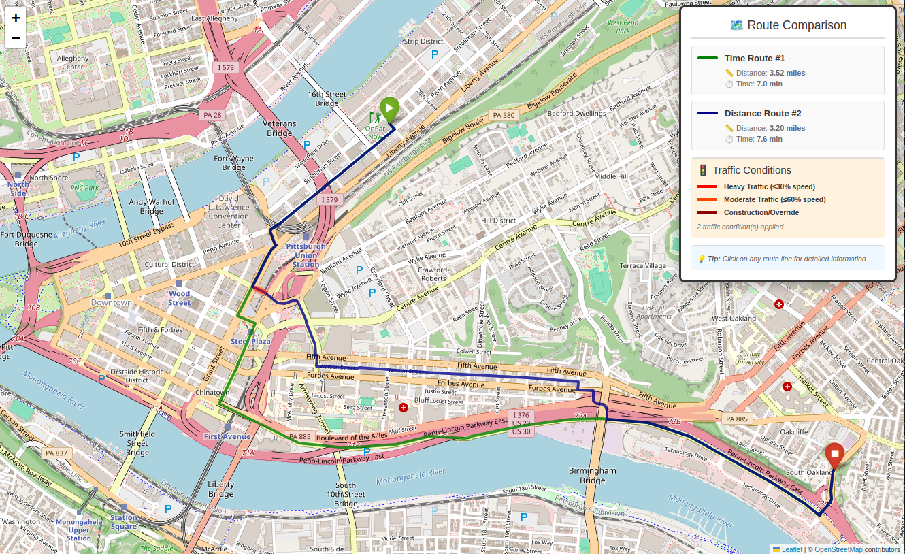

# Route Planner

A C++ route planning system with graph search algorithm implementations for OpenStreetMap road networks.



## Features

- **A\* Path Planning**: Distance and time-based route optimization
- **Extensible Architecture**: Planner factory for easy addition and testing of new algorithms
- **Traffic Modeling**: Edge-specific speed modification based on traffic conditions
- **Road Type Support**: Intelligent speed defaults based on road classification
- **Interactive Visualization**: Web-based route and traffic overlay on maps
- **OSM Data Processing**: Python scripts to download and parse OpenStreetMap data

## Environment Setup

### C++ Dependencies

**Ubuntu/Debian:**
```bash
sudo apt update
sudo apt install build-essential cmake git
sudo apt install nlohmann-json3-dev libyaml-cpp-dev
```

### Python Environment

Create and activate virtual environment:
```bash
python3 -m venv .venv
source .venv/bin/activate
```

Install Python dependencies:
```bash
pip install -r requirements.txt
```

## Dependencies

### C++
- CMake 3.10+
- C++17 compatible compiler
- nlohmann_json 3.9.1+
- yaml-cpp

### Python
See `requirements.txt` for complete list. Main dependencies:
- [folium](https://python-visualization.github.io/folium/) (interactive maps)
- [pandas](https://pandas.pydata.org/) (data processing)
- [geopandas](https://geopandas.org/) (geospatial data)
- [pyrosm](https://pyrosm.readthedocs.io/) (OSM parsing)
- [PyYAML](https://pyyaml.org/) (configuration)

## Build

```bash
mkdir build && cd build
cmake ..
make
```

## Usage

### Data Processing
You will need to download an OpenStreetMap data file (PBF). Depending on bounding box area, this can get very large. I used [bbox finder](http://bboxfinder.com/#0.000000,0.000000,0.000000,0.000000) tool to find coordinates for Downtown Pittsburgh and neighbouring areas.  

Download OSM data:
```bash
python scripts/osm_downloader.py --bbox -80.031 40.410 -79.896 40.494
``` 

Extract nodes and edges from OSM data file:
```bash
python scripts/osm_parser.py --input data/bbox_*.pbf --output-dir data/
```

### Configuration

Before you can plan routes, you will need to configure the planner. Edit `config/default.yaml` or create your own config with:
- Planner type and cost functions
- Data file paths
- Highway speed defaults
- Traffic conditions
- Default start/end coordinates

### Basic Route Planning
```bash
./bin/route_planner --start-lat 40.4499 --start-lon -79.9862 --end-lat 40.4334 --end-lon -79.9583
```

### Visualization
Interactive web-based visualizer with traffic support 
```bash
python scripts/visualizer.py --csv results/route_time_*.csv --show-traffic
```

## Future Work

- **Advanced Algorithms**: Anytime A\*/D\*, D\* Lite, weight reuse from previous iterations
- **Turn Penalties**: Incorporate realistic turning costs at intersections
- **Multi-objective Cost Functions**: Optimize for multiple criteria simultaneously (time, distance, fuel/battery, safety)
- **Lane-aware Planning**: Utilize lane information for more accurate routing
- **Emergency Scenarios**: Support for road closures and emergency vehicle response

## License

MIT License - see LICENSE file for details.